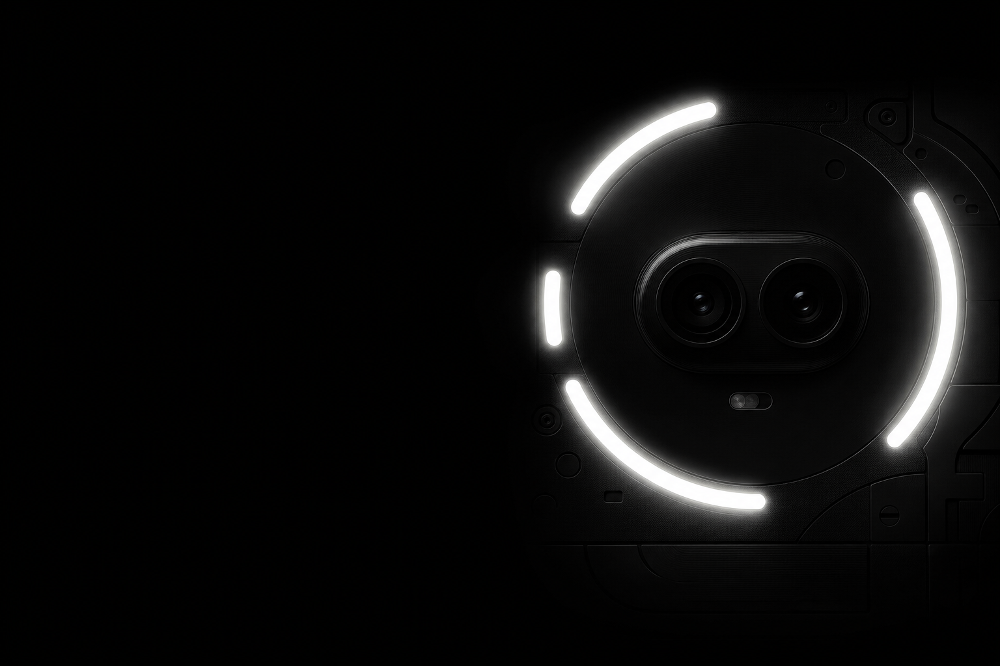
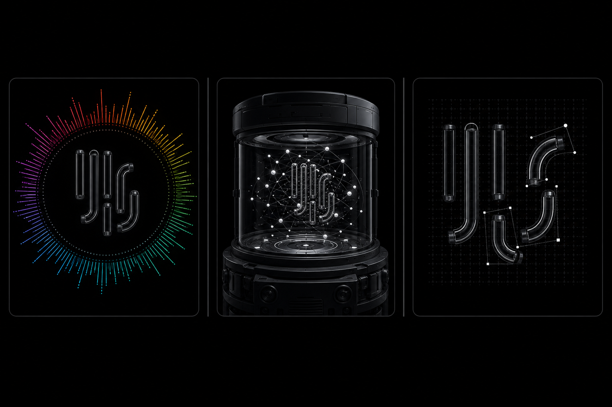
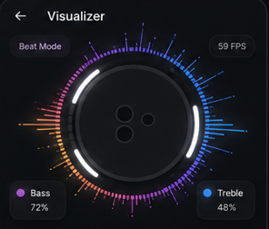
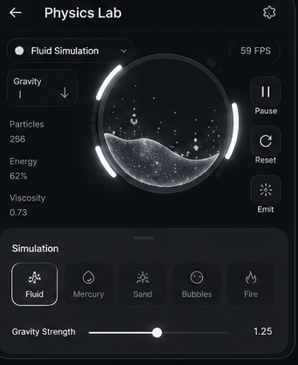
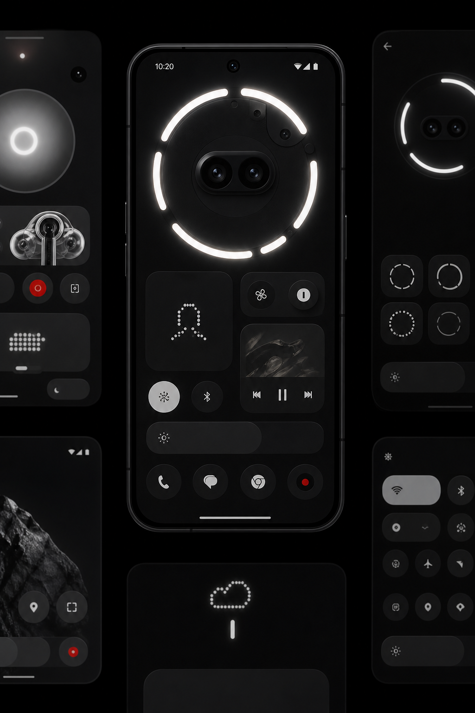
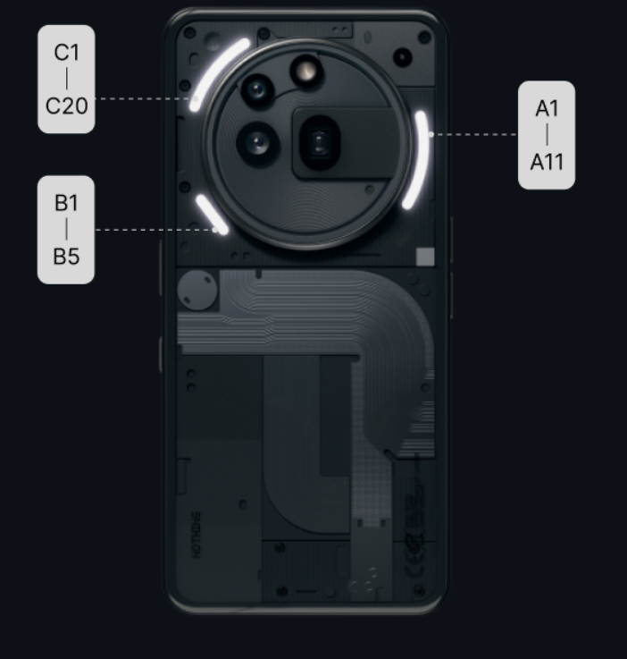

# Glyph Studio

<p align="center">
  
</p>

<p align="center">
  <strong>Design · Animate · Perform</strong><br/>
  A premium creative studio for the Nothing Phone <strong>(3a)</strong> / <strong>(3a) Pro</strong> Glyph Interface.
</p>

<p align="center">
  
  
  
  
  
</p>

---

## Overview

**Glyph Studio** turns the rear Glyph lights into a creative canvas. Paint tubes, draw paths, run physics simulations, and react to music — all mapped to the official **36-channel** Phone (3a) doughnut layout.

<p align="center">
  
</p>

| Studio module | What it does |
|---------------|--------------|
| **Dashboard** | Live Glyph hero, device status, Continue Editing |
| **Editor** | Paint / Erase / Fill bent LED tubes with undo & zoom |
| **Path Builder** | Draw sequences, timeline scrub, send to Glyph |
| **Physics Lab** | Gravity, fluid, sand & more on the doughnut ring |
| **Visualizer** | Audio → spectrum + tube lighting |
| **Controls** | Interactive Glyph map with arc-contextual tools |
| **Settings** | Appearance, animation, performance, about |

---

## Screenshots

<table>
  <tr>
    <td width="50%" align="center">
      <br/>
      <sub><b>Visualizer</b> — radial spectrum + bent Glyph tubes</sub>
    </td>
    <td width="50%" align="center">
      <br/>
      <sub><b>Physics Lab</b> — chamber simulation + live tubes</sub>
    </td>
  </tr>
  <tr>
    <td width="50%" align="center">
      <br/>
      <sub><b>Glyph map</b> — hardware-accurate bent tubes</sub>
    </td>
    <td width="50%" align="center">
      <br/>
      <sub><b>Hardware reference</b> — Phone (3a) A / B / C arcs</sub>
    </td>
  </tr>
</table>

---

## Glyph hardware map

Official Nothing Phone **(3a)** / **(3a) Pro** channel layout ([Glyph Developer Kit](https://github.com/Nothing-Developer-Programme/Glyph-Developer-Kit)):

| Arc | Segments | SDK indices | Orientation |
|-----|----------|-------------|-------------|
| **A** | A1 → A11 | 20 – 30 | Right arc (A1 top, A11 bottom) |
| **B** | B1 → B5 | 31 – 35 | Short strip (B1 bottom-right, B5 top-left) |
| **C** | C1 → C20 | 0 – 19 | Left / top arc (C1 bottom-left, C20 top) |

**Clockwise doughnut path (with gap bridges):**  
`A1…A11 → B1…B5 → C1…C20 → A1`

<p align="center">
  
</p>

---

## Features in depth

### Content-first studio UI
- Nothing OS–inspired monochrome theme with soft Glyph glow
- Bent-tube previews (not dots) across Dashboard, Editor, Paths, Physics, Controls, Visualizer
- Progressive disclosure — primary actions visible; advanced options in sheets

### Editor
- Tools: **Paint · Erase · Fill · Preview**
- Undo / redo, zoom controls, haptic feedback, glow settings
- Live hardware sync via absolute `setChannels` frames

### Path Builder
- Draw on the doughnut, scrub an on-canvas timeline
- Preview / Play transport + advanced path ops in a bottom sheet
- Save / load sequences (presets + user library)

### Physics Lab
- Modes: Gravity, Fluid, Mercury, Sand, Bubble, Magnet, Zero-G, Pinball
- Sensor-driven tilt; mass constrained to the A/B/C ring
- Chamber particle visualization, FPS / gravity HUD, persistent settings

### Music Visualizer
- Pulse · Wave · Beat · Glow
- Multicolor radial spectrum around lit tubes
- Bass / Treble glass cards; on-device mic processing only

### System integration
- Home-screen **Glance** widget
- **Quick Settings** tile
- App-wide theme preference (Dark / Light / System)

---

## Architecture

```
app/src/main/java/com/example/gliphlights/
├── di/                 # Hilt modules
├── editor/             # Glyph map, gestures, tube renderer, SDK bridge
├── pathbuilder/        # Path record → optimize → animation engine
├── physics/            # Sensors, solvers, Physics Lab UI
├── visualizer/         # Audio → Glyph modes
├── repository/         # Glyph + Settings + sequences DataStore
├── sdk/                # GlyphManagerWrapper
├── ui/                 # Screens, theme, studio chrome
├── viewmodel/          # Screen ViewModels
└── widgets/            # Glance widget + QS tile
```

**Stack:** Kotlin · Jetpack Compose · Material 3 · Hilt · KSP · Navigation · Glance · DataStore · Coroutines

---

## Requirements

| Item | Detail |
|------|--------|
| Device | Nothing Phone **(3a)** or **(3a) Pro** (`Common.is24111()`) |
| OS | Android 14+ (API 34) |
| SDK | Nothing Glyph SDK (`com.nothing.ketchum`) |

---

## Build

```bash
# Debug APK
./gradlew assembleDebug

# Or open in Android Studio and Run
```

> **SDK AAR:** Place `GlyphSDK.aar` from the  
> [Nothing Glyph Developer Kit](https://github.com/Nothing-Developer-Programme/Glyph-Developer-Kit)  
> into `app/libs/` if it is not already present.

---

## SDK usage notes

- Prefer **`setChannels`** for absolute frames (Editor / Path / Physics / Visualizer)
- Keep **`toggleChannels`** for single-channel XOR toggles in Controls
- Sessions are shared carefully across screens — avoid closing the Glyph session from Dashboard teardown

---

## OpenSpec

Product specs and archived change proposals live under `openspec/`:

- Live capabilities → `openspec/specs/`
- Completed changes → `openspec/changes/archive/`

---

## Author

**Anirudh Rao** — Glyph Studio  

Independent companion app for creative lighting on compatible Nothing phones.  
Nothing, Glyph, and related marks are trademarks of their respective owners. This project is not affiliated with or endorsed by Nothing Technology Limited.

Microphone access (Visualizer) is processed **on-device** and is not uploaded.

---

## License

MIT — see repository license terms for details.

<p align="center">
  <br/>
  <sub>Built for the doughnut. Made to glow.</sub>
</p>
